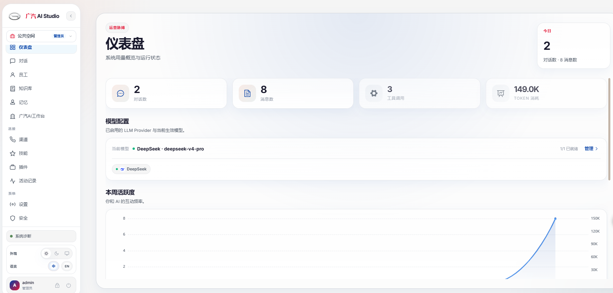

<div align="center">

# 英威腾 AI 智能体平台

<p align="center"><b>新一代企业级 AI 智能体平台</b></p>

<p align="center">Spring Boot 3.5 · Vue 3 · 217 位数字员工 · 一个 JAR 交付</p>

[](https://adoptium.net/)
[](https://spring.io/projects/spring-boot)
[](https://vuejs.org/)
[](LICENSE)



</div>

---

## 这是什么

一个**自己能跑的完整 AI 平台**——不是你 SaaS 账号里的一页聊天，而是部署在你自己服务器上的全栈应用。

| 你得到的 | 不是你想象的那种 |
|---|---|
| 217 位有岗位、有目标、有背景故事的数字员工 | 一个通用聊天框，每次都要重新告诉它你是谁 |
| 多厂商故障转移，主模型挂了下一家接着把话说 | 厂商抽风就两手一摊，丢你一张红色错误卡 |
| LLM Wiki——PDF 扔进去，长出带链接、带引用的知识页 | 向量搜索翻出一段话，不知道它从哪来的 |
| ReAct + Plan-and-Execute 运行在 StateGraph 上 | 一次 RAG 调用披件外套就叫 Agent |
| 敏感操作走审批，完整审计日志 | 工具随便调，出事了不知道谁干的 |

**英威腾是根基，AI Studio 是愿景。**
部署一次——推理、知识、记忆、工具、多渠道入口，从第一天就一起设计，不是事后拼接。

---

## 快速开始

```bash
# 后端 (Java 21 + Maven 3.9+)
cd invt-ai-platform-server
mvn spring-boot:run                    # → http://localhost:18088

# 前端 (Node 18+)
cd invt-ai-platform-ui
pnpm install && pnpm dev               # → http://localhost:5173
```

默认登录: `admin` / `admin123`

### Docker 部署
```bash
cp .env.example .env
docker compose up -d                    # → http://localhost:18080
```

---

## 核心能力

### 🤖 数字员工体系（217 位 · 23 个领域）
不是聊天机器人，是按**岗位 + 目标 + 背景故事**定义的员工。

| 领域 | 数量 | 代表 |
|------|------|------|
| 工程开发 | 36 | AI 工程师 · 前端开发者 · 后端架构师 · 安全工程师 |
| 专业化 | 46 | MCP 构建器 · 提示词工程师 · 文档生成器 · 模型 QA |
| 市场营销 | 36 | SEO 专家 · 内容创作者 · 抖音策略师 · 小红书运营 |
| 财务管理 | 8 | 财务分析师 · 财务追踪员 · FP&A 分析师 |
| 销售 | 8 | 售前工程师 · 赢单策略师 · Pipeline 分析师 |
| 测试 | 9 | API 测试员 · 性能基准师 · 无障碍审核员 |
| 设计 | 8 | UI 设计师 · UX 研究员 · 品牌守护者 |
| 产品 | 5 | 产品经理 · 趋势研究员 · 反馈分析师 |
| 其他 | 60+ | 法律 · HR · 供应链 · 学术 · 游戏开发 · 空间计算 · 项目管理 |

每位员工选中后，对话页面的 4 个快捷提问**自动按岗位/目标生成**，选谁问谁。

### 🧠 Agent 运行时
- **ReAct** — 思考 → 行动 → 观察 → 循环推理
- **Plan-and-Execute** — 先规划再分步执行，适合复杂任务
- **StateGraph 引擎** — 真正的状态机运行时，不是 prompt 模拟
- **员工间委派** — 一位员工可以把子任务委派给另一位

### 🔄 模型故障转移
Key 过期、厂商 401、网络抖动、配额耗尽——自动切到下一家健康供应商。

内置 **Provider Health Tracker**，连续失败的供应商进冷却窗口。Drag-and-drop 拖拽排序优先级，健康面板实时亮灯。

支持 14+ 家: DeepSeek · OpenAI · Anthropic · Gemini · DashScope · Kimi · Ollama · LM Studio · MLX · ...

### 📚 LLM Wiki 知识引擎
上传 PDF、Markdown、网页 → 自动消化成结构化 Wiki 页面。
- 页面之间自动长 `[[链接]]`
- 每句话记得出处，点开引用抽屉看原始 chunk
- 热点缓存自动注入员工 system prompt

### 🔌 技能 · MCP · ACP
三种接外部能力的方式，收敛进同一个注册表：

- **SKILL.md 技能包** — manifest + prompt + 工具 + LESSONS.md（用得越多越聪明）
- **MCP** — stdio / SSE / Streamable HTTP，每位员工独立绑定
- **ACP** — 桥接 Claude Code、Codex 等顶级编码 Agent
- **Tool Guard** — RBAC + 审批流 + 文件路径保护
- **插件 SDK** — Java JAR 热加载，一键导入

### 🏗️ 业务流程编排
- **工作流** — 7 种 step mode（sequential / fan_out / collect / conditional / await_approval / dispatch_channel / write_memory）
- **触发器** — 6 种 pattern（cron / webhook / channel_message / agent_lifecycle / content_match / workflow_completion）

### 🔒 企业就绪
RBAC + JWT · Personal Access Token · Webhook 出站 HMAC-SHA-256 · Cron 分布式锁 · 完整审计事件流 · Flyway 管理 schema · 生产 MySQL / 开发 H2

---

## 项目结构
```
invt-ai-platform/
├── invt-ai-platform-server/          Spring Boot 3.5 · 1596 Java 文件
│   ├── agent/                     Agent 运行时 (StateGraph · ReAct · PlanExecute)
│   ├── channel/                   多渠道适配 (Web · 企微 · 飞书 · 钉钉 · Telegram · ...)
│   ├── llm/                       多厂商模型管理 + 故障转移
│   ├── memory/                    结构化记忆系统
│   ├── plugin/                    插件 SDK + 热加载
│   ├── skill/                     SKILL.md 技能引擎
│   ├── tool/                      工具注册表 (MCP · ACP · 内置)
│   ├── wiki/                      LLM Wiki 知识引擎
│   └── workflow/                  工作流编排 + 触发器
├── invt-ai-platform-ui/              Vue 3 + TS · 160 Vue 文件
│   ├── views/                     页面 (员工 · 对话 · 技能 · 知识 · 安全 · 插件 · ...)
│   ├── components/                组件 (chat · common · goal · live · workflow · ...)
│   ├── composables/               逻辑 (useChat · useStream · useMessages · ...)
│   └── stores/                    状态 (useGoalStore · useSystemSettingsStore · ...)
├── invt-ai-platform-webchat/         网页嵌入式聊天组件
├── invt-ai-platform-plugin-api/      第三方插件 SDK
├── invt-ai-platform-plugin-sample/   参考插件实现
├── docker-compose.yml
└── .env.example
```

---

## 技术栈

| 层 | 技术 |
|---|---|
| 后端框架 | Spring Boot 3.5 · Spring AI · MyBatis Plus · Flyway |
| Agent 引擎 | StateGraph · ReAct · Plan-and-Execute |
| 前端 | Vue 3 · TypeScript · Vite · Element Plus · Pinia |
| 数据库 | H2 (开发) · MySQL 8.0+ (生产) |
| 认证 | Spring Security + JWT |
| 桌面端 | Electron + 内嵌 JRE 21 |

---

## 许可证
[Apache License 2.0](LICENSE)
